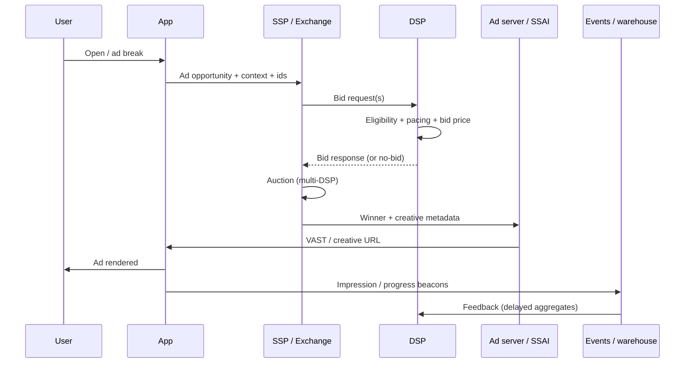

# Programmatic flow: app open → identity → bid → auction → serve → feedback

**Purpose:** Walk through the **real end-to-end path** from “user opens an app” to “money and metrics update,” with **who does what**, **timing**, and **concrete examples**. This complements [SSP vs DSP](./05-ad-server-SSP-DSP-programmatic.md), [forecasting & pacing](./07-forecasting-pacing-yield.md), and [targeting](./04-targeting-frequency-daypart-geofence.md).

**One-line story:** A **sell-side** surface (app, site, CTV) asks “what ad goes here?”; **identity** and **context** are attached; **buyers** (often via a **DSP**) decide if they can spend and **how much**; an **auction** picks a **winner**; **yield** logic may reorder priorities; the **creative** is shown; **events** flow back so budgets, models, and reports stay honest.

---

## 0. System roles (so the steps land in the right place)

| Role | Typical owner | In this doc |
|------|----------------|------------|
| **Publisher / app** | Streaming service, news site, game | Creates the **ad opportunity** (placement, pod slot) |
| **SSP / exchange** | Often publisher-side | Sends **bid requests**, runs **auction** timer, collects responses |
| **DSP** | Advertiser / agency | **Eligibility**, **pacing**, **bid** for campaigns it represents |
| **Ad server** | Often publisher | **Delivery**, **direct** line items, **allocation** vs programmatic |

In practice these **blur** (bundled products, in-house stacks). Below uses a **common programmatic** shape: many steps run **in parallel** and **under ~100–300ms** total (CTV can differ).

---

## 1. User opens app

**What happens:** The client loads; the player or app requests content. When an **ad break** is coming (linear pod, preroll, midroll) or a **banner** slot is on screen, the **ad stack** prepares an **opportunity** (one **impression** “slot”).

**Example — CTV:** Viewer starts an episode. After 8 minutes the client signals `adBreakStart`. The **SSAI** or client SDK knows pod length (e.g. 90s) and how many **slots** (e.g. 3 ads).

**Example — mobile feed:** User scrolls; a list cell with placement id `banner_home_320` becomes **≥50% visible**. The mediation SDK calls `loadAd`.

**Example — web:** Page renders an iframe slot; **header bidding** wrappers and GPT-style tags queue a unified auction.

**Engineering note:** This step is mostly **client integration** (SDK, VAST, OpenRTB from the seller side). The “heavy” systems wake up when a **bid request** or **internal decision request** is built.

---

## 2. Identity resolved

**What happens:** The stack attaches **who/what** this opportunity belongs to for **targeting**, **frequency**, **measurement**, and **compliance**. Resolution is **not** always a named person—it is whatever **signals** are legally and technically available.

**Common signals:**

- **Device advertising ID** (where allowed), **cookie**/first-party id, **publisher login** id  
- **IP-derivable** geo (coarse), **contextual** URL/app bundle/channel/genre  
- **Household** or **cohort** identifiers in some TV / clean-room setups  
- **Consent** flags (TCF, opt-in) gating which ids are sent

**Example — streaming app (logged in):** User `publisher_uid=abc123`, device CTV, DMA=501, watching **Sports**. Bid request includes segments + “no MAID” if platform forbids.

**Example — mobile game:** IFA available; frequency cap keyed on `campaign_X + device_id`.

**Example — web (no login):** First-party cookie `pubcid`; contextual categories from page; geo from IP.

**Detail:** [First-party vs third-party, device vs household](./03-data-first-party-third-party-household-device.md). Mismatched identity = wrong **frequency**, wrong **reach**, or **privacy** incidents.

---

## 3. DSP checks campaign eligibility

**What happens:** For each **bid request**, the **DSP** (or parent buying platform) filters **which campaigns** may even participate: **active dates**, **budget** not hard-stopped, **targeting** match, **creative** allowed for this format, **brand safety**, **deals** (PMP/PG), **frequency caps**, **geo/daypart**, block lists.

**Example:** Request: preroll video, 15s max, US only, “News” app bundle. Campaign A (US video, IAB-15s creative trafficked) → **eligible**. Campaign B (banner-only) → **out**. Campaign C (excluded “News” category) → **out**.

**Example — deal:** Bid request carries `dealid=private-deal-7721`. Only campaigns **whitelisted** on that deal are **eligible**.

**Parallelism:** A large DSP evaluates **thousands** of campaigns with **inverted indexes** (audience → campaigns); most work is **filter out fast**.

---

## 4. Forecasting ensures pacing (and budget honesty)

**What happens:** Among **eligible** campaigns, the DSP asks: “Should we **spend** right **now**?” **Pacing** spreads a **daily/monthly budget** across time so the line item neither **exhausts at 8am** nor **misses delivery** at 11pm. **Forecasting** supplies expected **inventory** and **win rates** so the bidder doesn’t fly blind.

**Example:** $50k/day line item. It’s 2pm; spend so far $18k. Model predicts heavy prime-time traffic; **pacing** may **throttle** bids now to save **budget** for higher-value impressions, or **push** if behind schedule.

**Example — under-delivery risk:** Small audience + low win rate → pacing **raises** effective aggression (within advertiser caps) to hit **delivery goals**.

**Detail:** [Forecasting, pacing, yield](./07-forecasting-pacing-yield.md). Interview depth: pacing is a **control system** (PID-like or rule-based), not “magic even spend.”

---

## 5. Bid calculated

**What happens:** For each **remaining** campaign × opportunity, the DSP computes a **bid price** (CPM in OpenRTB terms, or internal score converted to currency). Inputs include **predicted value** (pCTR/pVC/VCR proxies), **advertiser constraints**, **deal price floors**, **exploration** (test higher/lower bids), and **margin**.

**Example:** Simple **linear** formula (real systems are messier): expected engagement × value per click + brand lift prior → **$12 CPM** bid for this impression.

**Example — performance:** CPA goal campaign: bid scaled from **pConversion** so expected CPA stays near target.

**Example — guaranteed deal:** Floor $20; DSP bids **$21** if eligibility + pacing allow.

---

## 6. Auction runs

**What happens:** The **SSP / exchange** (sometimes **ad server** mediation) collects **bids** from multiple DSPs (and **sometimes** house campaigns). A **mechanism** picks a provisional winner: commonly **second-price** (pay clearing rule) or **first-price** depending on era/partner; **header bidding** may merge with **server-side** demand.

**Example:** Three DSP responses: $9, $14, $12. Second-price auction might clear at **$12.01** style rule (exact clearing depends on **exchange rules**).

**Example — no bid:** All DSPs pass; **fallback** house promo, **PSD** (programmatic guaranteed) backup, or **blank** pod depending on product.

**Example — timeout:** DSP answers at **t+350ms**; wire deadline was **180ms** → bid **dropped**.

**Staff point:** **Auction** fairness, **timeout** SLOs, and **auction simulation** for revenue are classic platform problems.

---

## 7. Yield optimization picks winner (publisher-side truth)

**What happens:** Even after a **programmatic** winner exists, the **publisher** often runs **yield** or **competition** logic: **direct** sold may beat **open market**; **sponsorship** may trump everything; **frequency** and **exclusivity** matter. “Yield optimization” is the umbrella for **maximizing publisher value** (revenue + strategic commitments), not only **highest CPM**.

**Example:** Open auction winner at $18 CPM, but a **direct** sports sponsorship line item at **$22 effective** (or contractual **100% share** in that pod) → **direct** wins.

**Example — unified auction:** Header bidding + exchange bids + ad server line items in **one** ranking.

**Example — frequency / pod rules:** “No two auto ads in same pod” → second-choice ad promoted.

This step is why interviews ask for **ad server + programmatic**, not “auction only.”

---

## 8. Ad served

**What happens:** The winning **creative** is **delivered**: VAST XML + media URL, VPAID/MRAID tags for measurement, or **image + click URL**. The **player** renders; **verification** vendors may run (OM SDK).

**Example — CTV:** SSAI stitches **MPEG-DASH** segments; **beacon** URLs embedded at quartiles.

**Example — in-app:** SDK loads video from CDN; **companion** end card after complete.

**Failure modes:** Creative **404**, **SSL** mixed content, **latency** → user sees black frame or **skip-to-content** policy fires.

---

## 9. Events tracked → feedback loop

**What happens:** **Impression** (and optionally **viewability**, **quartiles**, **clicks**, **conversions**) fire as **pixels**, **server-to-server** events, or **SDK** callbacks. Data lands in **streams** (e.g. Kafka), **data warehouse**, and **billing**. **DSP pacing** and **bid models** consume aggregates; **publisher** reporting updates; **fraud** filters run.

**Example impression path:** Player hits `imp` beacon → SSP normalizes id → **deduped** in warehouse → **dashboard** + **invoice** + **pacing** spend increment.

**Example feedback loop:** Overnight, **win/loss** and **CTR** features retrain **bid shading** model; next day bids shift **±5%** on similar inventory.

**Example — A/B test:** Experiment flag in [ad serving basics](./01-ad-serving-and-ab-testing-basics.md) changed **ranking**; metrics compared on **stable** assignment.

**Close the loop:** Without reliable **events**, **pacing lies**, **advertisers** dispute bills, and **models** drift wrong.

---

## End-to-end example (single timeline)

**Scenario:** Weeknight, **CTV sports** app, 2-ad pod, user logged in.

1. **App** declares midroll; builds Opportunity #1.  
2. **Identity:** `publisher_uid`, device class **CTV**, DMA, **consent=personalized ads on**.  
3. **DSP** (BuyerCo): Campaign “Spring Promo” **eligible** (geo, genre sports OK, video 30s creative ready).  
4. **Pacing:** Line item **on track**; not throttled.  
5. **Bid:** Model outputs **$16 CPM**.  
6. **Auction:** Another DSP at **$14**; BuyerCo **wins** clearing at **$15** (illustrative second-price story).  
7. **Yield:** Publisher compares to **direct**; direct **loses** tonight → programmatic stands.  
8. **Serve:** 30s spot plays; **verification** marks **in-view** for 96%.  
9. **Events:** Impression + quartiles log; **BuyerCo** spend +$0.016 (× scale of pricing math); **frequency cap** increments for that **household** keying strategy.

Repeat for Opportunity #2 with possibly **different** winner.

---

## Sequence diagram (conceptual)

---

## What to say in an interview

- **Ordering:** Identity and **context** constrain **eligibility**; **pacing** gates **spend**; **bid** is last-mile **pricing**; **auction** is **multi-party**; **yield** is **publisher truth**; **serve** is **fulfillment**; **events** close the **loop**.  
- **Failure:** Name **timeouts**, **identity** gaps, **pacing bugs**, **auction fallbacks**, and **missing beacons**.  
- **Scale:** Mention **parallel** evaluation, **SLO per hop**, and **idempotent** event ingestion.

---

*See also: [`../staff-deep-dive-guide/03-system-design-ad-serving-experiments.md`](../staff-deep-dive-guide/03-system-design-ad-serving-experiments.md) for Staff-level system design.*
