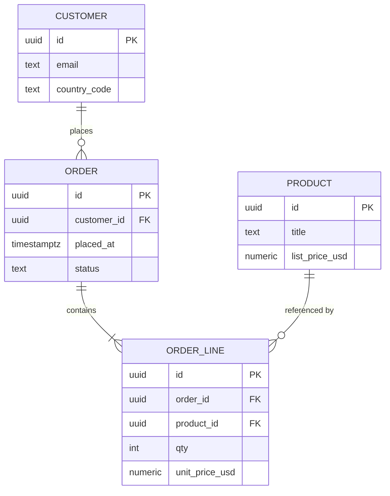

# 1 — Entities, attributes, relationships (beginner)

**Goal:** Think in **things** (entities), **properties** (attributes), and **connections** (relationships) before worrying about SQL or NoSQL. This file uses **two running examples** you can trace through the whole guide: **bookstore orders** and **ad campaigns**.

---

## 1.1 Entity

An **entity** is a **category** of thing your system stores and reasons about. You can usually name it with a **noun**, and each **instance** (row/document/event) should be **distinguishable**—most often via an **identifier**.

**Good entity candidates:**

| Entity | One instance is… |
|--------|------------------|
| **Customer** | One person or company you sell to |
| **Order** | One checkout transaction (`ORD-2025-0842`) |
| **Campaign** | One advertiser line item with its own budget and dates |
| **Creative** | One renderable ad asset (video file + tracking URLs) |

**Not always an entity:**

- **“Total revenue last Tuesday”** — usually a **metric** computed from **Order** and **OrderLine** rows, not its own eternal entity.
- **Exception:** You might **materialize** `daily_revenue_summary` as a table for **dashboard speed**—then it becomes an entity whose **meaning** is “pre-aggregated snapshot,” not raw truth (see file `05`).

**Entity vs attribute:** If the “thing” only makes sense **inside** another thing and never stands alone, it might be an **attribute** or a **child entity** (e.g. “shipping address” might be columns on `orders` or a child table if reused/history matters).

---

## 1.2 Attribute

An **attribute** is a **named property** of an entity—what you’d put in a column or JSON field.

**Bookstore example — `customers`:**

| Attribute | Example value | Notes |
|-----------|---------------|--------|
| `id` | `c_1001` | Identifier (often surrogate) |
| `email` | `ada@example.com` | Natural-ish; can change over time |
| `country_code` | `US` | Stable dimension for reporting |
| `created_at` | `2025-01-10T08:00:00Z` | Lifecycle |

**Ad tech example — `campaigns`:**

| Attribute | Example value |
|-----------|---------------|
| `id` | `cmp_88a92` |
| `advertiser_id` | `adv_44` (relationship to another entity) |
| `budget_usd_cents` | `5000000` ($50,000) |
| `start_at` / `end_at` | Flight dates |

**Composite vs simple:** A **postal address** can be `street`, `city`, `postal_code` (simple columns) or a **`postgis`** point + formatted label—pick based on **queries** (“find customers in ZIP 94107” needs structured fields).

---

## 1.3 Relationship

A **relationship** is a **business rule** connecting entities, usually written as a sentence:

- “Each **Order** belongs to **exactly one Customer**.”
- “Each **Order** contains **many OrderLines**.”
- “Each **Campaign** can target **many Placements**, and each **Placement** can serve **many Campaigns**” → that last one is **many-to-many** (file `04` shows the junction table).

In a relational database, relationships become **foreign keys** (or junction tables for M:N). In documents, they might become **nested arrays** or **stored ids**—tradeoffs in file `08`.

---

## 1.4 Cardinality (say it clearly)

| Pattern | Rule in words | Bookstore | Ad stack |
|---------|----------------|-----------|----------|
| **1:1** | At most one B per A and one A per B | `users` ↔ `user_pii` (split for privacy) | Rare; sometimes **campaign** ↔ **single approved master** creative |
| **1:N** | One parent, many children | **Customer** → **Orders** | **Advertiser** → **Campaigns** |
| **M:N** | Many on both sides | **Students** ↔ **Courses** via **enrollment** | **Campaigns** ↔ **Placements** via **targeting** / **deals** |

**Interview tip:** Saying “many-to-many” without “**junction** (associative) table” sounds incomplete in relational OLTP.

---

## 1.5 Worked example — bookstore (conceptual + sample rows)

**Entities:** `Customer`, `Order`, `Product`, `OrderLine`.

**Relationships:**

- Customer **1:N** Order  
- Order **1:N** OrderLine  
- Product **1:N** OrderLine (each line names one product and qty)

**Why `OrderLine` exists:** A single order can include **multiple products**. If you tried to put `product_id` and `qty` directly on `orders`, you’d repeat the order header for every product line—or squash multiple products into one row (breaks 1NF). The **line** entity is the standard fix.

**Sample rows (illustrative):**

`customers`

| id | email | country_code |
|----|--------|----------------|
| c_1001 | ada@example.com | US |
| c_1002 | bob@example.com | CA |

`orders`

| id | customer_id | placed_at | status | currency |
|----|---------------|-----------|--------|----------|
| o_5001 | c_1001 | 2025-03-20T14:22:00Z | paid | USD |
| o_5002 | c_1001 | 2025-03-21T09:01:00Z | paid | USD |

`products`

| id | title | list_price_usd |
|----|--------|----------------|
| p_900 | “Algorithms 101” | 45.00 |
| p_901 | “Data Modeling” | 52.00 |

`order_lines`

| id | order_id | product_id | qty | unit_price_usd |
|----|----------|------------|-----|----------------|
| ol_1 | o_5001 | p_900 | 1 | 45.00 |
| ol_2 | o_5001 | p_901 | 2 | 50.00 |

**Why `unit_price_usd` on the line:** On March 20 the book might have been **on sale** at $50 even if `products.list_price_usd` is $52 today. The line stores **price at order time**—a **snapshot** for money and disputes (deep dive in file `07`).

---

## 1.6 Worked example — ad tech (conceptual + sample rows)

**Entities:** `Advertiser`, `Campaign`, `Creative`, `Placement`, and for serving **CampaignPlacement** (junction) for M:N.

**Relationships:**

- Advertiser **1:N** Campaign  
- Campaign **1:N** Creative  
- Campaign **M:N** Placement via **`campaign_placement`**

**Sample rows:**

`advertisers`

| id | name |
|----|------|
| adv_44 | Acme Co |

`campaigns`

| id | advertiser_id | name | budget_usd | start_date | end_date |
|----|---------------|------|------------|------------|----------|
| cmp_1 | adv_44 | Spring promo | 50000 | 2025-03-01 | 2025-03-31 |

`placements`

| id | surface | format |
|----|---------|--------|
| pl_news_app_ios_preroll | news_app_ios | preroll_15s |
| pl_news_app_web_mpu | news_web | mpu_300x250 |

`campaign_placement` (link + edge facts)

| campaign_id | placement_id | bid_floor_usd | priority |
|-------------|----------------|---------------|----------|
| cmp_1 | pl_news_app_ios_preroll | 12.00 | 1 |
| cmp_1 | pl_news_app_web_mpu | 4.00 | 2 |

`bid_floor_usd` describes **this campaign on this placement**, not the whole campaign—belongs on the **junction**.

---

## 1.7 From requirements to a first sketch (process)

1. List **nouns** from user stories (“customer places order,” “line item”).  
2. For each noun, decide: **entity** or **attribute** of something else?  
3. Draw **lines** between entities; label **1:1 / 1:N / M:N**.  
4. For M:N, draw a **diamond** junction in the middle (name it).  
5. List **attributes** per entity; flag **ids**, **money**, **timestamps**, **PII**.  
6. Only then pick **SQL vs document** (file `08`) and **keys** (file `02`).

---

## 1.8 Strong vs weak entity (optional ER vocabulary)

A **strong entity** has its **own** identifier in the real world (`Customer`, `Campaign`).

A **weak entity** depends on a **parent** for uniqueness—“one **seat reservation** on **this flight**” is only unique as **(flight_id, seat)**. In SQL you still give `reservation` a surrogate PK, but **business uniqueness** is **`UNIQUE(flight_id, seat_label)`**.

**Example:** `order_line` line numbers: line **1** on order A and line **1** on order B are different rows—**natural** identity is **`(order_id, line_no)`** even if you also have `line_id uuid`.

---

## 1.9 Attribute domains, units, and money (depth)

Modeling is not just names—it is **domains**:

| Concern | Bad | Better |
|---------|-----|--------|
| Money | `float` | `numeric(12,2)` or **integer minor units** (`cents`)—never float for currency |
| Time | “Local time only” | `timestamptz` + explicit **reporting timezone** policy |
| Country | free `text` | `CHAR(2)` **ISO-3166** or FK to `ref_country` |
| Status | unbounded strings | **enum**/check constraint: `pending \| paid \| shipped` |

**Example:** `campaigns.budget_usd_cents bigint NOT NULL` avoids **floating** rounding when **pacing** sums thousands of micro-spends.

---

## 1.10 Optional and mandatory participation (ER clarity)

- **Optional:** “A **user** **may** have **zero or one** **extended profile**” → 1:0..1 on profile side; in SQL `LEFT JOIN` or nullable FK on the **optional** side depending on where FK lives.  
- **Mandatory:** “Every **order line** **must** belong to an **order**” → `order_id NOT NULL REFERENCES orders(id)`.

Saying **optional vs mandatory** out loud prevents you from `INNER JOIN`ing rows users never created.

---

## 1.11 Subtype / superclass pattern (when types share columns but differ)

**Example:** `payment` is either **card**, **wallet**, or **invoice**. Shared: `amount`, `currency`, `order_id`. Specific: `last_four`, `wallet_provider`, `invoice_due_date`.

**Option A — one table + sparse columns + `type` discriminator:** Simple; many NULLs; check constraints per type (`type=card ⇒ last_four IS NOT NULL`).

**Option B — `payments` parent + `payment_card` / `payment_wallet` child tables (1:1):** Clean; more joins; best when **PII** differs by type.

Interviewers like hearing **tradeoffs**, not “always normalize.”

---

## 1.12 Full ER sketch (bookstore) — mermaid

---

## 1.13 What you should be able to say

- “I separate **who** (customer), **what happened** (order), and **line detail** (order line) so reporting and refunds stay sane.”  
- “I put **per-link** fields on the **junction**, not on one side only, when they describe the **pair**.”  
- “I define **domains** for money and time before indexing; I use **subtypes** when optional fields explode by type.”

**Next:** [Keys & identifiers](./02-keys-identifiers-uniqueness.md).
